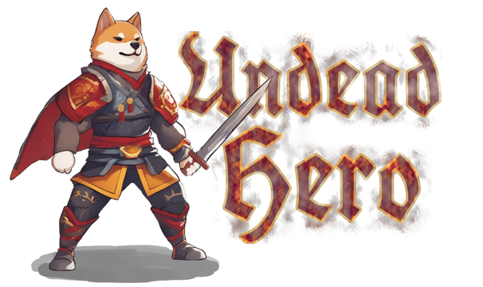

  

*When restless spirits aimlessly roam through the dark vastness of Samhain night and chilly winds howl amongst barren trees, the Ellsworth manor faces powerful witchcraft the likes of which it has never seen before.*

*This story is about Lord Ellsworth's favorite dog Waffles, a fluffy guardian who swore to protect his beloved master even in the afterlife. A couple of decades has passed since the two were buried together, but the peaceful rest was disturbed by a looming danger coming after the old lord.*

*Through the power of devotion, and with the help of benevolent forces, Waffles gets back into the world of the living, to unveil the dark truths behind the unnatural magic and save Lord Ellsworth, proving once again that he is indeed a good boy.*

## What is this?

The Undead Hero is a tech-demo project meant to showcase my competence as a game developer. Namely, to demonstrate my artistic vision, autonomy, and ability to write clean, testable, and expandable code.

This project is based on the brilliant Knowledge Syndicate's [course](https://lms.k-syndicate.school/architecture-unity-games/) - made by 2 industry veterans and aimed at experienced developers - to deepen my Unity knowledge even further.

Some of the project features I would like to highlight:

- Highly decoupled, atomic, easily testable services, most of which can be reused in other projects.
- Automatic DI with `VContainer` for both game services and in-game objects (where appropriate).
- Rewarded Ad videos using `LevelPlay` (IronSource) mediation.
- Comfortable tools for game designers for adding and testing new content (Editor extensions, gizmos, scriptable objects)
- Rendering optimizations (Static batching, GPU instancing, appropriate mobile shaders, non-directional lightmapping, light probes, texture atlases, manual mesh tweaks, terrain fine-tuning, UI canvases separation)
- Static data containing all the gameplay-related definitions, making it easy to change things on the go and update game content separately from its codebase.

This project implements some concepts and mechanics that, ideally, should not co-exist in the same game. One of the goals of this project is to demonstrate a broad set of solutions for well-known problems. May game designers forgive me.

### Showcase / Walkthrough

TODO: YouTube video

### Known issues

There are a bunch of [potential improvements and ideas](https://github.com/snezhniylis/UndeadHero/issues) that can be easily implemented. However, considering this project's state and my lack of free time, I deem it ready for public release. No project is ever *good enough™*.

Another thing I should definitely mention is that this project's code utilizes `sameLineBrace {` placement, which is very uncommon amongst Unity developers. I always follow style guides set by the team and understand that others would prefer another well-established approach. Here it was purely preferential, with no expectations that someone else would be working with my code.

## Download

Pre-compiled binaries for Android, Windows, and Linux can be found [here](https://github.com/snezhniylis/UndeadHero/releases).

## Building

### Requirements

- Unity 2022.3+
- [OpenUPM](https://openupm.com/) (for [VContainer](https://openupm.com/packages/jp.hadashikick.vcontainer/))

## License & Credits

Although heavily modified, this project is still based on Knowledge Syndicate's [Architecture](https://lms.k-syndicate.school/architecture-unity-games/) course. It's unclear to me whether one can license course derivatives, so I opted out not to.

### Used assets

#### External plugins / tools

- [VContainer](https://github.com/hadashiA/VContainer) by hadashiA
- [IronSource SDK](https://github.com/ironsource-mobile/Unity-sdk/) by IronSource
- [EDM4U (jar-resolver)](https://github.com/googlesamples/unity-jar-resolver) by Google
- [PlayerPrefs Editor](https://assetstore.unity.com/packages/tools/utilities/playerprefs-editor-167903k) by BG Tools
- [Simple Input System](https://assetstore.unity.com/packages/tools/input-management/simple-input-system-113033) by yasirkula

#### Artistic

|                                                                                                                                                                             |                                            |
|-----------------------------------------------------------------------------------------------------------------------------------------------------------------------------|--------------------------------------------|
| [Jack O Lantern](https://iconscout.com/icon/jack-o-lantern-2713584) by Andinur Studio                                                                                       | Essence counter icon                       | 
| [Basic RPG Icons](https://assetstore.unity.com/packages/2d/gui/icons/basic-rpg-icons-181301) by PONETI                                                                      | Item and Event icons                       |
| [GUI Parts](https://assetstore.unity.com/packages/2d/gui/icons/gui-parts-159068) by PONETI                                                                                  | UI and HUD elements                        |
| [Halloween Cemetery Set](https://assetstore.unity.com/packages/3d/environments/fantasy/halloween-cemetery-set-19125) by 3dfancy                                             | Terrain textures + Meshes (Cemetery level) |
| [Dog Knight PBR Polyart](https://assetstore.unity.com/packages/3d/characters/animals/dog-knight-pbr-polyart-135227) by Dungeon Mason                                        | Hero mesh + animations                     |
| [Mini Legion Lich PBR HP Polyart](https://assetstore.unity.com/packages/3d/characters/humanoids/fantasy/mini-legion-lich-pbr-hp-polyart-91497) by Dungeon Mason             | Lich enemy mesh + animations               |
| [Mini Legion Rock Golem PBR HP Polyart](https://assetstore.unity.com/packages/3d/characters/humanoids/fantasy/mini-legion-rock-golem-pbr-hp-polyart-94707) by Dungeon Mason | Golem enemy mesh + animations              |
| [Cartoon FX Remaster Free](https://assetstore.unity.com/packages/vfx/particles/cartoon-fx-remaster-free-109565) by Jean Moreno                                              | All FXs in the game                        |

